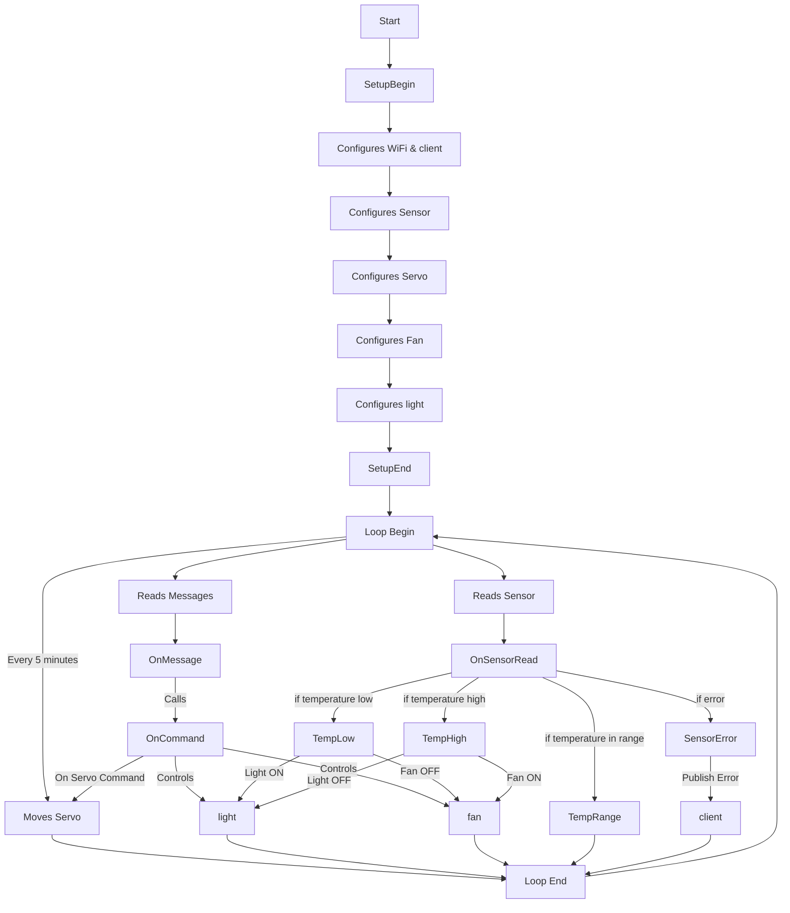

# DOCS

- [ESP32 user guide](https://docs.espressif.com/projects/esp-dev-kits/en/latest/esp32/esp32-devkitc/user_guide.html#overview)

- [DHT11 sensor info](https://www.electronicwings.com/sensors-modules/dht11)

